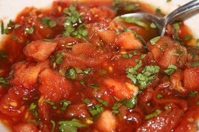

# Sambal salamat

*This hot tomato sambal is very popular in Indonesia, it has a very strong flavour and should be used sparingly.*

**Yield:** 120 ml

## Ingredients
- 3 ripe tomatoes
- half teaspoon of salt
- 1 fresh red chilli (de-seeded and chopped)
- 4 tablespoons Thai fish sauce
- 1 tablespoon coriander (freshly chopped)

## Method
1. Cut a small cross in the base of each tomato.
1. Place the tomatoes in a pan of boiling water and leave for about 30 seconds, or until the skin around the cross begins to peel away.
1. Lift out the tomatoes with a slotted spoon and plunge into a bowl of ice cold water.
1. Peel away the skins from the tomatoes, and cut the tomatoes in half.
1. Remove the seeds from the tomatoes, and chop the flesh finely and place in a bowl.
1. Add the salt, chopped chillies, fish sauce and coriander.
1. Mix well, and set aside for at least 2 hours before serving so that the flavours combine.