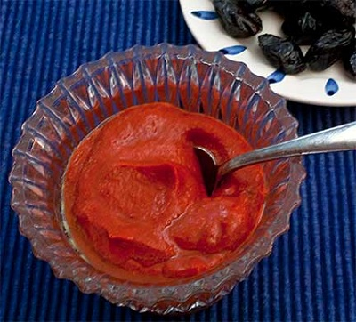

# Harissa

*Serve this hot, spicy condiment as a dipping sauce or stir it into soups or stews. When added to natural yoghurt it makes a very good marinade for pork or chicken.*

**Yield:** 120 ml
## Ingredients
- 12 dried red chillies
- 1 tablespoon coriander seeds
- 2 teaspoon cumin seeds
- 2 garlic cloves
-  half teaspoon salt
- 4 tablespoons olive oil

## Method
1. Snap the chillies, and shake out some of the seeds.
1. Put the chillies in a bowl and pout over enough warm water to cover them, and leave to soak for 30 minutes.
1. Meanwhile, dry-fry the coriander and cu,in seeds until they give off a rich aroma, making sure that they do not burn.
1. Tip the seeds into a mortar and grind them to a fine powder with a pestle.
1. Tip the ground spices into a bowl and set aside.
1. Put the garlic in the mortar, sprinkle it with salt and pound to a paste.
1. Drain the chillies, add them to the paste and pound until smooth.
1. Add the spices, then gradually work in the oil, trickling it in and mixing until the sauce is well blended and has a consistency of mayonnaise.