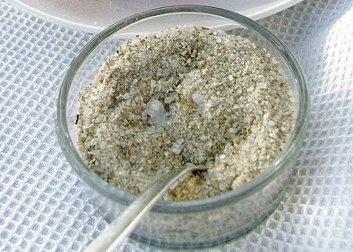

# Aromatic salt

*A lot of Balti recipes call for aromatic salt, which is a blend of light spice mixture with sea salt. Ordinarily salt can be used in its place, but the spicing adds a delicacy and subtlety to a recipe.*

*What follows are two salt recipes, the first being light and aromatic, the second containing spicier tastes as well as nuts.*

*The salt should be stored in screw top container away from bright light.
Ingredients*

## Lightly spiced aromatic salt
- 100 grams coarsely granulated sea salt
- 1 teaspoon cinnamon
- 1 teaspoon ground allspice

## Spicy aromatic salt
- 100 grams coarsely granulated sea salt
- 1 teaspoon cinnamon
- 1 teaspoon ground allspice
- ½ teaspoon ground fenugreek seeds
- 1 teaspoon dried mint
- 1 tablespoon ground almond
- ½ teaspoon tumeric
