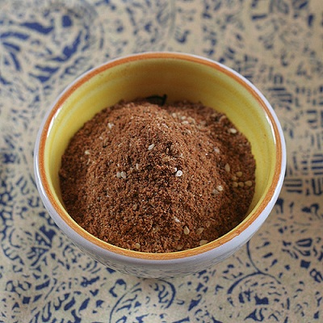

# Baharat

*Variations on this spices can be found in all the countries that border the easter Mediterranean, from Egypt and Jordan to the Lebanon and Syria. It's uses have also spread south, to the Sudan and Ethiopia. The Arabic name Baharat is simply translated to "spice".*

**Yield:** 115 grams

## Ingredients
- 1 cinnamon stick
- 2 tablespoons coriander seeds
- 2 tablespoons cumin seeds
- 6 tablespoons cardamom seeds
- 2 tablespoons cloves
- 2 tablespoons black peppercorns
- 4 tablespoons paprika
- 1 teaspoon ground allspice
- 2 teaspoons grated nutmeg
- 2 teaspoons chilli powder

## Method
1. Grind the cinnamon stick in a spice mill or coffee grinder, and tip into a bowl.
1. Heat a frying pan, and add the coriander, cumin and cardamom seeds along with the cloves and peppercorns.
1. Roast the spices, shaking the pan over a medium heat until they give off a rich aroma and just begin to change colour.
1. Grind the whole roasted spices in a large mortar until they form a fine powder (do this in batches if necessary).
1. Add the ground spice mixture to the cinnamon and mix well to blend in the flavours.
1. Stir in the paprika, ground allspice, grated nutmeg and chilli powder.
1. Use immediately or store in an airtight jar away from strong light.

