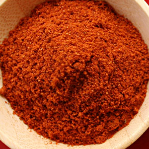

# Berbere

*Ethiopia produces some of Africa's most delicious food. Dishes, such as the spicy stews, fuelled by the fire of this hot spices mixture, are served on large discs of bread, called injera.*

**Yield:** 50 grams

## Ingredients
- 10 dried red chillies
- 8 white cardamom pods
- 1 teaspoon cumin seeds
- 1 teaspoon coriander seeds
- 1 teaspoon fenugreek seeds
- 8 cloves
- 1 teaspoon allspice berries
- 2 teaspoon black peppercorns
- 1 teaspoon ajowan seeds
- 1 teaspoon ground ginger
- half a teaspoon freshly grated nutmeg
- 2 tablespoon salt

## Method
1. Snap the chillies and remove some of the seeds.
1. Heat a heavy-based frying pan.
1. Bruise the cardamom pods, and add them to the pan along with the chilli, cumin, coriander, fenugreek, cloves, allspice berries, peppercorns and ajowan seeds.
1. Roast the spices, shaking the pan over a medium heat until they give off a rich aroma.
1. Remove the cardamom pods, and discard the husks.
1. Tip the seeds into a mortar along with all the roasted spices and grind to a fine powder.
1. Stir in the ginger, nutmeg and salt.
1. Use immediately or store in an airtight jar for up to 4 weeks.

