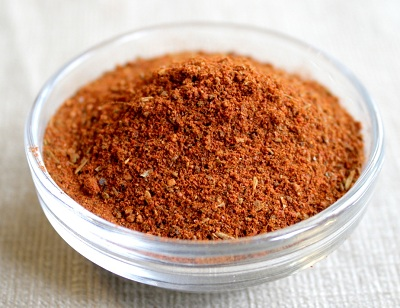

# Cajun spice mix

*This Cajun spice mix is famous in classic dishes such as gumbo and jambalaya. It also works well in stews and thick soups.*

**Yield:** 150 ml

## Ingredients 
- 1 onion (finely chopped)
- 2 garlic cloves (finely chopped)
- 1 teaspoon black peppercorns
- 1 teaspoon cumin seeds
- 1 teaspoon white mustard seeds
- 2 teaspoons paprika
- 1 teaspoon chilli powder (or cayenne)
- 1 teaspoon dried oregano
- 2 teaspoon dried thyme
- 1 teaspoon salt

## Method
1. Dry-fry the peppercorns, cumin and mustard seeds over a medium heat to release their flavours, making sure that they do not burn and become pungent.
1. Transfer the roasted spices to a mortar, and grind them to a fine powder.
1. Add the paprika, chilli powder, oregano, thyme and salt.
1. Keep grinding until the spices form a fine powder.
1. Add the spices to the finely chopped garlic and onion and tip into a food processor and blend until well combined. 
1. Use immediately.