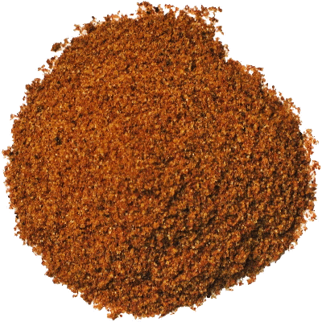

# Dry Fajita seasoning mix

**Serves:** 2  
**Cooking time:** 10 minutes

## Ingredients
- 2 breasts of skinless chicken (cut into strips)
- 1 tablespoon oil
- 2 teaspoons chili powder
- 1 teaspoon salt
- 1 teaspoon paprika
- ½ teaspoon onion powder
- 1/4 teaspoon garlic powder
- 1/4 teaspoon cayenne pepper
- 1/4 teaspoon cumin
- 1 tablespoon corn starch (optional thickener)
- 2 peppers (cut into strips)

## Method
1. Combine all ingredients in a small bowl and mix to combine. 
1. Heat the oil in a pan, and add the chicken and cook over a medium heat. 
1. When the chicken begins to turn white, sprinkle over the Fajita mix and continue to cook for 5 minutes.
1. Add the peppers and cook for a further 5 minutes.