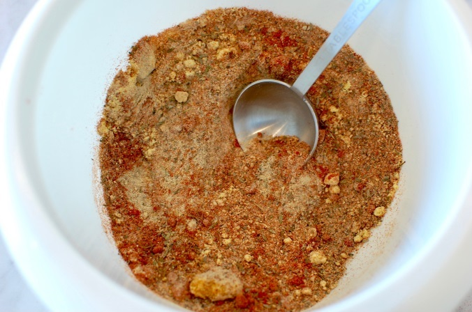

# KFC style herbs and spices

## Ingredients
-  2⁄3 tablespoon salt  
- 3 tablespoons white pepper  
- 1⁄2 tablespoon thyme  
- 1⁄2 tablespoon basil  
- 1⁄3 tablespoon oregano  
- 1 tablespoon celery salt  
- 2 tablespoons garlic salt  
- 1 tablespoon black pepper  
- 1 tablespoon dry mustard  
- 4 tablespoons paprika  
- 1 tablespoon ground ginger  

## Method
1. Mix together all 11 herbs and spices and store in a cool, dark cupboard. 