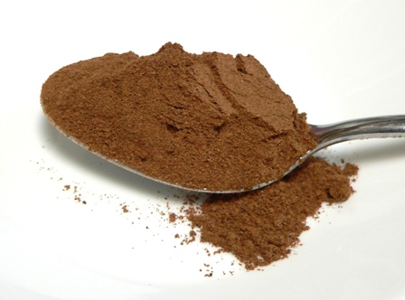

# Mixed spice

*This mixture of ready ground spices has a whole host of uses, both in sweet and savory dishes. It typically contains cinnamon, nutmeg and allspice but can also contain cloves, cayenne pepper and ginger.*

**Yield:** 63 grams

## Ingredients
- 1 tablespoon ground allspice
- 1 tablespoon ground cinnamon
- 1 tablespoon ground nutmeg
- 2 teaspoon ground mace
- 1 teaspoon ground cloves
- 1 teaspoon ground coriander
- 1 teaspoon ground ginger

