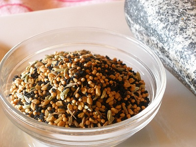

# Panch phoram

*This is a Bengali mixture of five (panch) spices. *

## Ingredients
- white cumin seeds
- fennel seeds
- fenugreek seeds
- mustard seeds
- wild onion seeds

## Method 
Simply mix together equal parts of each (a teaspoon is plenty), and grind in a mortar and pestle.