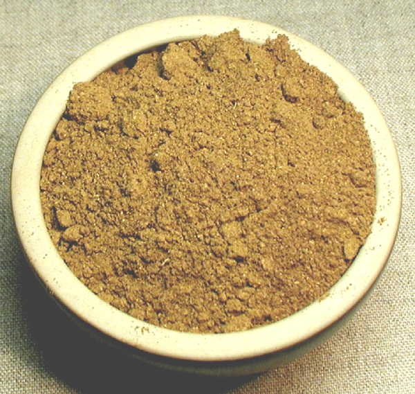

# Quatre épices

*A spice blend mainly used in France, but also found in Middle Eastern kitchens. The name literally means "Four spices". It is typically found in soup, ragout and pot cooked dishes such as paté, sausage and terrine.*

## Ingredients
- 1 part ground pepper
- 1 part ground cloves
- 1 part ground nutmeg
- 1 part dried ginger (ground)

