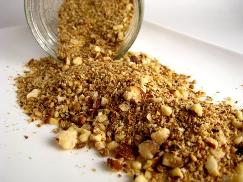

# Tsire powder

*This simple spice mixture is used as a coating for kebabs throughout West Africa. Cubes of raw meat are first dripped in oil or beaten egg, then coated in the powder. The cooked kebabs are dusted with a little more powder before being served.*

**Yield:** 60 ml

## Ingredients
- 50 grams salted peanuts
- 1 teaspoon mixed spice
- 1 teaspoon chilli powder
- salt

## Method
1. Grind the peanuts to a coarse powder in a mortar.
1. Add the mixed spice, chilli powder and a little salt, and process until well blended.
1. Use immediately or transfer to an air tight container and store in a cool place for up to 6 weeks.
