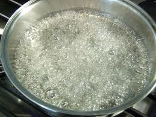

# Sirop a sorbet

*This syrup is used for all sorbets and for soaking sponge biscuits and Genoise sponges.*
 
**Yield:** 1 litre

## Ingredients
- 750 grams sugar
- 650 ml water
- 90 grams glucose

## Method
- Combine all the ingredients in a saucepan and bring to the boil, stirring occasionally with a wooden spatula. 
- Boil for about 3 minutes, skimming the surface if necessary. 
- If you have a saccharometer, the reading should be 30° Beaumé got 1.2624 on the density scale.
- Pass the syrup through a conical strainer and leave until completely cold before using.