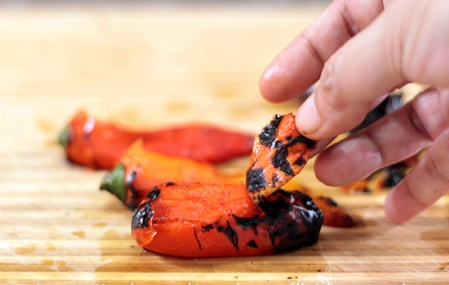

# De-skinning peppers

*Removing the skin from peppers can be done one of two ways, the first uses the roasting method which will cook the internal flesh of the pepper, and the other sears the peppers on a naked flame so that the internal flesh is less cooked.*

## Roasting
1. Turn the oven on to 200°C to roast the peppers.
1. Cut the tops off the red peppers, de-seed and discard the white pith.
1. Rub the peppers all over with oil.
1. Place the peppers, bottom side up on a tray in the oven and roast until the skins become black.
1. Remove the peppers from the oven and place in a plastic food bag to sweat. 
1. Once the peppers become cool, remove from the bag and pull the skins off and discard.

## Searing
1. Rub the peppers all over with oil.
1. Insert the teeth of a fork into the top of a pepper, and hold the pepper over a naked flame.
1. Turn the pepper slowly so that the skin is evenly cooked.
1. Keep turning the pepper until the skin is black and charred.
1. Immediately plunge the pepper into ice cold water to cool it down.
1. Once the peppers become cool, the skin can be pulled off and discarded.
1. Cut the top off the pepper, remove pith and seeds.

