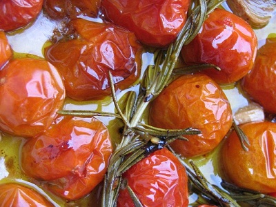

# Semi-confit cherry tomatoes

*These tomatoes can be served as tapas, on toast, in pasta dishes and salads or as a flan filling.*

*To serve these warm, heat under a warm grill or in a small saucepan with a little of their oil.*

**Yield:** 700 grams

## Ingredients
- 1 litre light olive oil
- 1 kg ripe cherry tomatoes
- 2 thyme sprigs
- 1 bay leaf
- 2 garlic cloves (unpeeled, halved)
- 15 grams white peppercorns (coarsely crushed)

Heat the olive oil in a saucepan and add the while, unpeeled tomatoes, thyme, bay leaf, garlic and crushed peppercorns.
Cook gently at about 70°C for 5 - 10 minutes; the riper and smaller the tomatoes, the less time they will take to confit.
Leave the tomatoes to cool in the pan, then transfer to a jar or bowl and pour over the oil.
Cover with cling film and refrigerate until ready to use.
The semi-confit tomatoes will keep well in their oil for at least 2 weeks in an airtight container in the refrigerator, just season with salt and pepper before using.