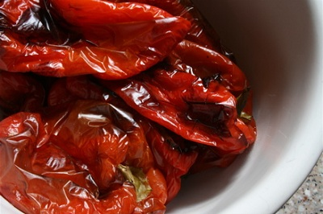

# Semi-confit peppers

*These peppers  taste even better when they are grilled on a barbecue, especially when vine shoots are added to the coals.*

**Yield:** 400 grams

## Ingredients
- 500 grams peppers
- 600 ml light olive oil
- 2 thyme sprigs
- 1 bay leaf
- 1 rosemary sprig
- 1 garlic clove (unpeeled)
- 1 teaspoon white peppercorns (coarsely crushed)

## Method
Using your fingertips, lightly smear the peppers with a little olive oil.
Grill them, preferably on a barbecue for the best flavour, until the skins burst and become blackened.
Plunge into iced water to refresh, then remove and peel off the skin.
Open up the peppers and remove the seeds and white membranes.
Pat the peppers dry and halve them.
Heat the olive oil in a saucepan and add the peppers, thyme, bay leaf, rosemary, garlic and crushed peppercorns.
Cook gently at about 70°C for 30 minutes.
Leave to cool, then transfer the peppers in their oil to a jar or bowl.
Cover with cling film and refrigerate until ready to use.