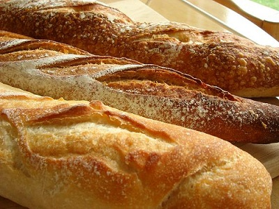

# Baguette

*Many people think that a French baguette, a long, thin loaf, is a good test of a baker’s skill. The baguette seems so simple, just flour, water, salt and yeast, kneading, fermenting, shaping, rising, slashing and baking. The reality is that a lot of very good bakers have spent a considerable amount of time and energy perfecting their baguette. The important characteristic of a baguette is that it is a bread that is meant to be eaten shortly after it is baked; it is not a bread that is intended to be stored on the counter top until the next day or beyond.*

## Ingredients

### Poolish
- 100 grams flour
- 100 grams water
- 0.5 teaspoon sugar
- 2 grams yeast

### Baguette
- 250 grams flour
- 125 grams water
- 1 teaspoon salt
- 5 grams yeast

## Method 
### To make the poolish
*The poolish needs to ideally be made about 18 hours in advance, so that the yeast has sufficient time to ferment, creating a wonderfully fragrant and delicious bread.*

- Add yeast, sugar and water to a small bowl.
- Mix up for a minute or two, and then leave for about 5 minutes. During this time the yeast will react with the water and sugar and will create a light froth on top of the water.
- Add the flour to a mixer bowl and create a small well, tip the the yeast mixture into this well and mix well with a wooden spoon until the water has completely combined with the flour.
- Cover the bowl with cling-film and store the bowl somewhere warm, about 15 - 20°C for about 18 hours or so.  An airing cupboard is usually an ideal place for this.

### To make the dough
- Once the poolish has had time to ferment, remove the cling film and stir gently with a wooden spoon.
- In a separate bowl, add the remaining 250 grams of flour, with the salt and remaining yeast.
- Weigh out 125 grams of warm water and add this to the poolish, stir with a wooden spoon to combine, then add this mixture to the flour.
- Mix for about 2 minutes until completely combined, then cover the bowl with a damp tea towel and allow to rest somewhere warm for 20 minutes. This is the autolyse.

### Kneading the dough
- Once the dough has rested, turn out on to a lightly floured surface and knead for 20 minutes. Do not at any point be tempted to add more flour to the mixture, if it becomes too sticky then rub a little olive oil on your hands.

### Four fermentation stages
- Place the dough back in the bowl and cover with a damp tea towel. Let ferment for 45 minutes.
- Remove the dough from the bowl and knock back, fold the dough back on to itself and knock back once again. 
- Put the dough back in the bowl, cover and let ferment for 45 minutes.
- Remove the dough from the bowl and knock back once again, turning the dough back over on to itself. 
- Put the dough back in to the bowl and cover with a damp tea towel and leave to ferment one last time somewhere warm for 30 minutes.
- Remove the dough from the bowl, knock back and place the dough on the counter and let it rest for 10 minutes under a damp tea towel.

### Shaping the dough
- Divide the dough into as many portions as you need, then let the dough rest for 10 minutes under the damp tea towel.
- Shape the dough into baguettes.
- Place the loaves on lightly greased baking trays, covered with a damp tea towel and leave to rise for 45 minutes. During this time, spray the tea towel with a fine mist of cool water from time to time.

### Baking the baguettes
- Heat oven to 225°C. 
- Traditionally stones or tiles are placed on the oven rack, and the bread is placed on top of these. Beneath the stones, the baker will place a large bowl of water to provide steam to the oven which helps the baking process.
- Once the oven is ready, add the baguettes to the stones or on a baking tray and bake for 15 minutes.
- Turn the loaves to equalise the baking and bake for a further 15 minutes.
- Turn the oven off and let the loaves sit in the cooling oven for about 5 minutes.
- Remove the loaves from the oven and allow to cool.