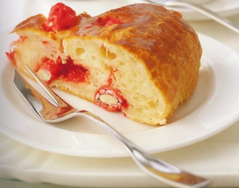

# St-Genix brioches with pink pralines

*Perfect for breakfast, these lovely brioches are best eaten as soon as they have cooled, while the pralines are still crunchy.*

*The town of St-Genix is famous for its Pompadour pink pralines, which flavour and colour these brioches.*

**Yield:** 8 - 10

## Ingredients
- 350 grams [brioche dough](../baking/pastry/brioche-dough.md)
- 20 pink pralines 
- eggwash (1 egg yolk mixed with 1 tablespoon milk)

## Method
1. On a lightly floured surface, push the brioche dough 2 or 3 times with the palm of your hand to make it supple and malleable.
1. Scatter the pink pralines over the dough and gently knead them in, making sure not to overwork the dough.
1. Shape the dough into a ball, put it on a lightly floured baking sheet and place a 20 cm diameter, 2 cm deep pastry ring around it.
1. Roll the dough with a rolling pin until it fills the ring, then remove the ring.
1. Leave to rise at about 25°C for an hour.
1. Preheat the oven to 180°C.
1. Brush the top of the brioche very lightly with eggwash and bake in the oven for 35 minutes.
1. Use a palette knife to transfer it to a wire rack and leave to cool before serving.