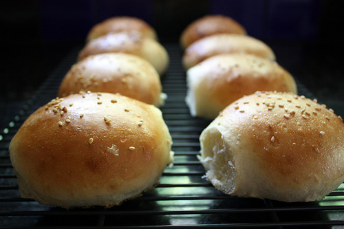

# Burger buns

*These golden topped burger buns are simple to make, and work especially well when cut in half, toasted and eaten as a steak sandwich. Where most people go wrong is not making the mixture wet enough and so the finished bread ends up too doughy and dry. Once the water is added, don't flood the work surface with flour as it will unbalance the recipe, instead, use olive oil if need be.*

**Yield:** 10

## Ingredients
- 500 grams Strong white flour
- 1 tablespoon caster sugar
- 25 grams lard
- 1 tablespoon salt
- 200 ml milk (tepid)
- 5 grams yeast (dried)
- 100 ml  water (tepid)
- 1 egg (beaten)
- sesame seeds (for sprinkling)

## Method
1. Mix the flour, sugar, lard and salt in a large bowl with the milk. 
1. Combine the yeast with the tepid water and mix thoroughly into a dough. 
1. Turn it out onto a lightly floured surface and knead for 10 minutes until your dough is soft and elastic. 
1. Leave to rise for 1 hour in a covered bowl left in a warm place.
1. Divide the dough into 10 pieces and on a lightly floured surface roll into balls with your hands. 
1. Then using a rolling pin flatten into 10 cm buns on a floured surface.
1. Place on baking trays lined with baking paper and brush beaten egg over each bap. 
1. Cover loosely with cling film and leave them in a warm place for 30 minutes.
1. Brush with a second coat of beaten egg and sprinkle a pinch of sesame seeds onto each bap. 
1. Cover loosely with cling film and leave for a final 30 minutes to rise.
1. Meanwhile preheat your oven to 200°C. 
1. Bake the buns until they are perfectly golden, about 10-15 minutes.