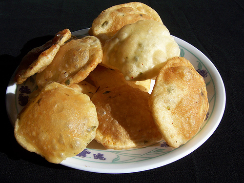

# Chilli pooris

*These small discs of dough puff up into light airy breads when fried. Lightly studded with pieces of chilli, they melt into your mouth and leave you with a warm glow.*

**Yield:** 12 pieces

## Ingredients
- 115 grams plain flour
- 115 grams wholemeal flour
- half teaspoon of salt
- half teaspoon mild chilli powder
- 2 tablespoons vegetable oil
- 1 fresh red chilli (de-seeded and finely chopped)
- 100 ml water (an extra 20 ml may be required if the dough is too firm)
- oil (for frying)

## Method
1. Sift the flours, salt and chilli powder into a large bowl.
1. Add the vegetable oil then mix in enough water to make a dough.
1. Turn the dough out on a lightly floured surface and knead for 10 minutes until it is smooth, elastic and springy.
1. Place in a lightly oiled bowl and cover with cling-film and leave to rest for 30 minutes.
1. Turn out on to a lightly floured surface.
1. Knead in the chopped fresh chilli then divide into 12 equal pieces.
1. Keeping the rest of the dough covered, roll one piece into a 13 cm round.
1. Repeat with the remaining dough.
1. Stack the pooris, layered between cling film.
1. Preheat the oven to a low 100°C.
1. Pour oil into a deep pan to a depth of 2.5 cm.
1. Heat the oil to 180°C or until a cube of day old bread, added to the oil, browns in about 45 seconds.
1. Using a spatula, lift one poori, and slide it into the oil; it will sink but will rise and begin to sizzle.
1. Press the poori into the oil. It will puff up.
1. Turn the poori over after a few seconds and cook for 20 - 30 seconds.
1. Remove the poori from the pan and drain on kitchen paper.
1. Keep warm in a pre-heated low oven while cooking the remaining pooris.