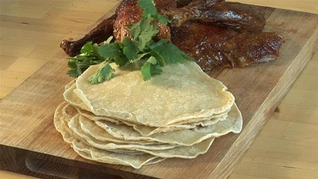

# Chinese pancakes

**Yield:** 6 - 8

## Ingredients
- 275 grams plain flour
- 225 grams very hot water
- 2 tablespoons sesame oil

## Method
### Making the dough
1. Put the flour into a large bowl.
1. Stir the hot water gradually into the flour, mixing continuously with chopsticks or a fork until the water is full incorporated.
1. Add more water if the mixture seems dry.
1. Remove the mixture from the bowl and knead with your hands for 8 - 10 minutes until it is smooth.
1. Put the dough back in the bowl, cover with a damp tea towel and let rest for about 30 minutes.

### Shaping the dough
1. Remove the dough from the bowl and knead again for about 5 minutes, dusting with a little flour if it is sticky.
1. Once the dough is smooth, form it into a toll about 45 cm long and 3 cm in diameter.
1. Using a sharp knife, cut the dough into about 18 equal segments.
1. Roll each segment into a ball.
1. Take two of the dough balls, dipping one side of one dough ball into sesame oil and place the oiled side on the other ball.
1. With a rolling pin, roll the two dough balls simultaneously into a circle about 15 cm in diameter. It is important to roll double pancakes in this way because the resulting dough will remain moist inside and your will be able to roll them thinner.

### Cooking the pancakes
1. Heat a frying pan or wok over a very low heat. 
1. Put a pancake into the wok and cook it until it has dried on one side.
1. Flip the pancake over and cook the other side.
1. Remove from the pan and peel the 2 pancakes apart and set them aside.
1. Repeat this process until all the dough balls have been cooked.