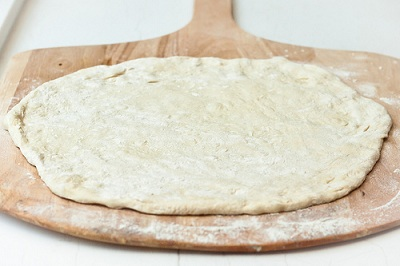

# Light pizza dough

*This dough makes a perfect light base for any pizza. The extra effort needed to make this fine dough is worth every second, as the resulting pizza is light and airy. This dough is best cooked in a non fan-assisted oven.*

*When kneading, it is tempting to add more flour to stop the dough from sticking to your hands or the table. You must not add more flour as this will make the resulting pizza to heavy. If the dough is sticking too much, add a little olive oil to your hands and rub over the dough.*

**Makes:** 1 kg

## Ingredients

### 1st stage
- 450 grams type '55' flour
- 330 ml water
- 20 grams fresh yeast

### 2nd stage
- 20 grams fine salt
- 25 grams caster sugar
- 50 ml extra virgin olive oil
- 120 grams type '55' flour

## Methos
### First stage
1. Put the flour into a bowl and check the temperature, register the air temperature and add the two figures. Together with the water, the sum should be 64°C. So if the combined flour and air temperatures are 50°C, then the water needs to be 14°C.
1. Make a well in the flour and crumble in the yeast.
1. Pour in a little water and mix with the yeast.
1. Gradually add the rest of the water, mixing with the fingertips of one hand.
1. Continue until the dough is smooth and homogeneous.
1. Cover with cling film and leave to rise in a warm place (20 - 24°C) for 8 - 12 hours.

### Second stage
1. On a lightly floured surface, punch the dough with one hand while folding it over itself with the other.
1. Use one hand to add the salt, sugar and olive oil, a little at a time, and finally add the flour.
1. Mix well and knead until the dough becomes elastic, has some body and is slightly sticky to the touch.
1. Cover with cling film and leave at room temperature for 1 hour.
The dough is now ready to use.