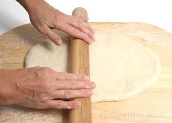
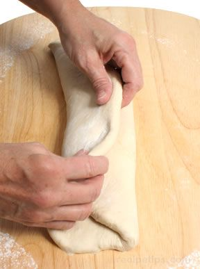
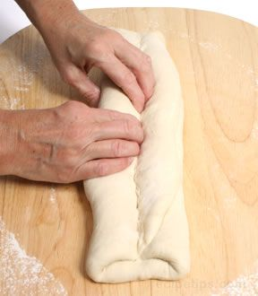
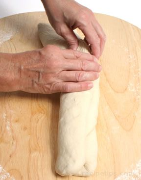
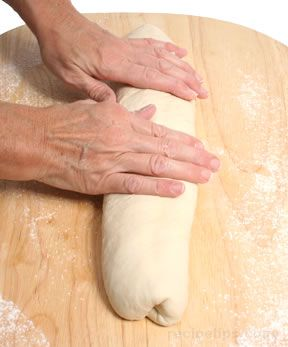
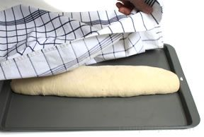
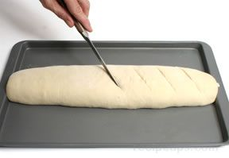

# Baguette
Baguette, which is the French term for "stick" or "little rod," is a long rounded shape that has become a popular name for a number of breads with a similar shape. A French baguette can be up to 2 feet in length, 2 to 4 inches in diameter, and weigh 9 ounces or more.

1. The baguette shape is created by first flattening the dough with the palms of your hands on a floured surface or by gently flattening the dough with a rolling pin.

2. While grasping the dough along the longest dimension, fold the dough into thirds (the two sides folded toward the center) similar to folding a sheet of paper to fit into an envelope.

3. Using your fingers, push into the centre of the dough along its entire length to create a long cavity.

4. Close the cavity by bringing the front half of the dough up and over the cavity and onto the top of the other half of the dough and then seal the seam.

5. With the seam side down, roll the dough back and forth with your hands. Begin in the center and while rolling the dough, move your hands outward along the length of the dough in order to gently stretch the dough to the desired length. Make sure the diameter is consistent along the length of the dough and then smooth the ends of the dough before the final rising.

6. Transfer the dough to a baking sheet or a baguette tray, straighten and smooth the dough, cover with a kitchen towel, and allow the dough to rise for the final time.

7. Before placing the dough into the oven, slash the dough diagonally every 2 or 3 inches along the length of the dough.
