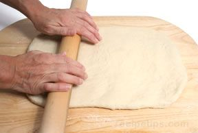
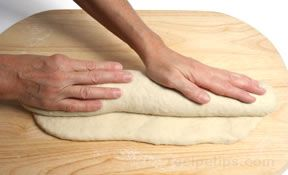
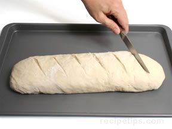

# Bloomer
Bloomer refers to a bread shape that is cylindrical, with slightly tapered ends, but flat on the bottom with several diagonal slashes across the top.   

1. To create a bloomer, roll out the dough (with a rolling pin) into the shape of rectangle with rounded corners. The longest dimension of the dough should be about 14 inches and the dough should be about 1 to 1½ inches thick.

2. Starting from one of the sides with the longest dimension, roll up the dough so that the final width of the loaf is about 4 or 5 inches. The ends should be tucked and smoothed.

3. Place the dough onto a lightly greased baking sheet, cover with a kitchen towel, and allow the dough to rise for the final time. Cut diagonal slashes across the top about 1½ inches apart (usually about 6 slashes) before placing the dough into the oven.
