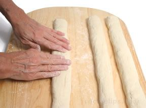
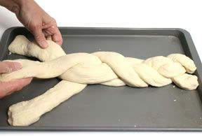
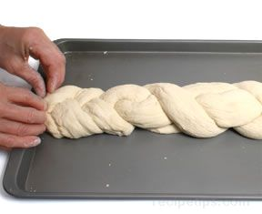
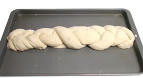

# Braided
Braided bread is made of strands of dough woven together to form a braided shape. 3 to 6 strands of dough are common for several varieties of braided bread and some may incorporate as many as 12 strands. For a simple braid, use 3 long pieces of dough.

1. Divide a batch of dough into 3 equal parts. On a floured surface, roll each of the pieces of dough back and forth with your hands. Begin in the center and while rolling the dough, move your hands outward along the length of the dough in order to gently stretch the dough to the desired length. Make sure the diameter is consistent along the entire length of each strand and that all 3 strands of dough are about the same diameter and length.

2. Place the 3 ropes of dough parallel to each other on a lightly greased baking sheet. Beginning in the center and moving toward one of the ends, braid the strands of dough by lifting the first strand over the middle strand, the third strand over the first strand, and the middle strand over the third strand. Repeat the same procedure for the opposite end of the dough strands, braiding from the center toward the end.

3. Seal both ends of the dough.

4. Allow it to rise for the final time before baking. (Cover the dough with a kitchen towel.)