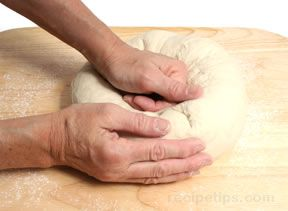
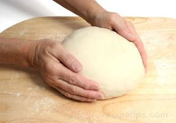

# Cob or Boule
Cob is a term that usually describes rounded loaves in Britain, while boule is a term that describes similar bread shapes in France.

1. Rounded loaves are fairly easy to create: simply push the dough into a rounded form, push down gently into the centre of the dough, and then flip the dough over to the other side.

2. With both hands cupped over the dough, rotate the dough in small increments while further shaping and smoothing the surface.

