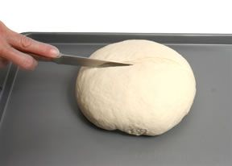
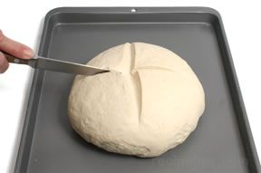

# Coburg
A Coburg is similar to a cob except that it has a cross slashed into the top.

1. Create a cob shape, place the dough onto a lightly greased baking sheet, cover with a kitchen towel, and allow the dough to rise for the final time. Slash the dough down the centre creating a deep score that divides the dough into halves.

2. Slash the dough again perpendicular to the first score, dividing the dough into quarters and then bake.