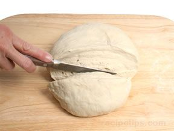
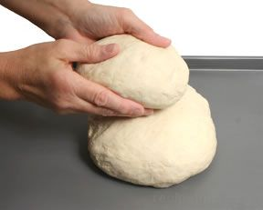
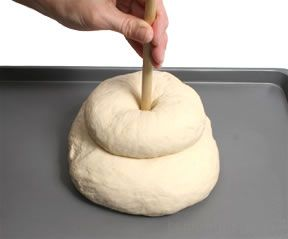
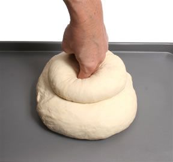

# Cottage
A cottage shape is a large, rounded shape similar to a cob or boule, but with a smaller round of dough placed on top. It is thought that the unusual shape was a result of the need to be as efficient as possible with the small baking space available in the ovens of earlier times.

1. Divide the dough into two pieces with one piece being twice the size of the other.

2. Shape the two pieces of dough into rounds. Place the larger round onto a lightly greased baking sheet and then place the smaller round on top of the larger one.

3. Use two fingers to create a hole through the center of the top round and continue through the bottom round.

4. A wooden dowel or handle of a wooden spoon also work well to create the hole. The hole welds the dough of the two rounds because some of the dough of the top round is pushed into the bottom round. Cover the dough with a kitchen towel and allow the dough to rise for the final time before baking.