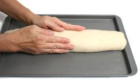
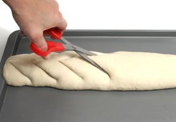
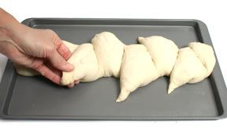

# Épi
Épi is a French bread shape that resembles an ear of wheat and is quite easy to make.

1. The shape is formed by first creating a baguette shape, but without the diagonal slashes. Place the dough onto a lightly greased baking sheet.

2. Use a scissors to cut into the top side of the dough every 2 to 2½ inches along the length of the baguette. The diagonal cuts should penetrate the dough about three-fourths of the way to the bottom. The cuts create flaps in the top side of the dough.

3. Push the flaps to the sides of the baguette, alternating sides with each flap of dough. Cover the dough with a kitchen towel and allow it to rise for the final time. When baked, the flaps form individual servings along the length of the bread, which can be easily broken off when the bread is served.