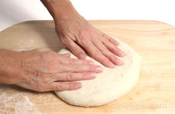
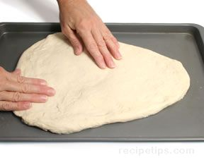
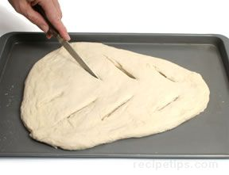
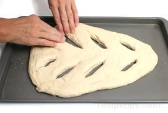

# Fougasse
A fougasse shape refers to a flattened bread shape with elongated holes, which give the bread the appearance of tree limbs. Fougasse is a popular bread in France and is often compared to focaccia bread of Italy.

1. The distinctive shape is created by first flattening the dough to about 2.5 inch thick.

2. Place the dough onto a lightly greased baking sheet and push and shape the dough into a form similar to a long triangle that is curved at the points.     

3. Cut diagonal slits through the dough about 2 or 3 inches apart on both the left and right sides, leaving about a 1 inch strip of dough in the center and around the perimeter.

4. Using your fingers, enlarge the slits into elongated holes and continue to push and smooth the dough until you are satisfied with the shape. Cover the dough with a kitchen towel and allow it to rise for the final time.

