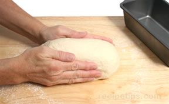
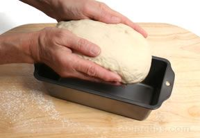

# Standard loaf pan

1. Bread dough can be shaped for a loaf pan simply by pushing the dough into an oval shape that is approximately the length of the pan.

2. The dough will conform to the shape of the pan during the second rising period.