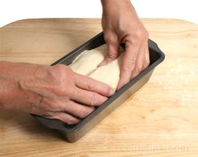
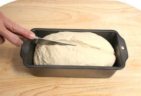

# Moulded tin or split pan
A moulded tin refers to a rectangular bread shape that has the appearance of being split down the length of the loaf.

1. One method for creating the shape is to use two portions of dough that are placed next to each other in the bread pan. The two pieces of dough should each be about half the width of the bread pan. Smooth the tops of the halves into a rounded form and then allow the dough to rise for the final time. When baked, the halves appear to be two very narrow rectangular loaves that are joined together.     

2. A simpler method of creating the loaf is to use one piece of dough that is rounded on the top and then cut a deep slash down the length of the dough. When baked, the bread will have the appearance of two halves.
