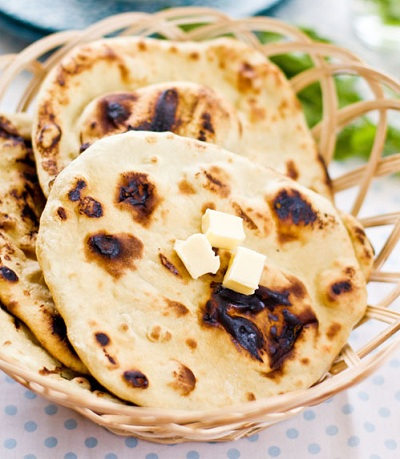

# Naan

*The original version of the naan and the oven it is cooked in, the tandoor, were brought to the North-West Frontier by the ancient Persians, who called them respectively nane and tonir. So they are a traditional staple food for Baltis and Kashmiris. The transition to the Balti house was a natural progression.

As with the rotis, they can be quite large. This method uses the grill and it produces a huge, light, fluffy, slightly sweet and chewy, mouth watering bread. The traditional tear-shape comes about because the bread is pressed on to the neck of the tandoor, and gravity causes it to elongate to the tear shape.*

**Yield:** 2

## Ingredients
- 450 grams strong white flour
- 1 tablespoon baking powder
- 1 tablespoon granulated sugar
- 2 tablespoons Greek yoghurt
- 1 teaspoon aromatic salt
- 2 teaspoons sesame seeds
- ½ teaspoon wild onion seed
- lukewarm water
- a little ghee (melted)

## Method
1. Choose a large ceramic or glass bowl and put in all the ingredients except the ghee.
1. Add warm water little by little and work it into the flour with your fingers, soon it will become a lump.
1. Remove from the bowl and knead on a floured board until well combined.
1. Return to the bowl and leave in a warm place for a couple of hours to prove.
1. Knock back the dough by kneading it down to its original size.
1. Divide the dough into two equal lumps.
1. Shape each lump into a ball, then on a floured work surface, roll each ball into a disc about 25 cm in diameter, and at least 5 mm thick.
1. Preheat the grill to three-quarters heat, cover the rack with foil and place the rack at the bottom of the grill, so that when the bread expands it does not burn.
1. Put the naan on the foil and grill, watching as it cooks so the it does not burn.
1. As soon as the first side develops brown patches, remove it from the grill.
1. Turn it over and brush the uncooked side with a little melted ghee.
1. Return to the grill and cook until sizzling.
1. Serve at once.