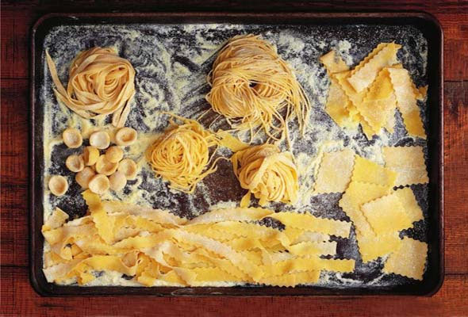

# Basic pasta

**Yield:**  300 grams

## Ingredients
- 300 grams 00 flour
- 3 eggs
- 1 tablespoon olive oil
- 1 pinch salt

## Method
1. Make a well in the middle of the flour, and crack the eggs into the well, pour in the olive oil and salt.
1. Gradually bring in the sides of the flour mixing into the egg, so that the egg binds with the flour. 
1. Roll into a ball and kneed for 10 minutes.
1. Place the dough into a bowl, and cover with cling film and refrigerate for 30 minutes.
1. Once chilled, kneed the dough again for 10 minutes and roll out flat with a rolling pin.