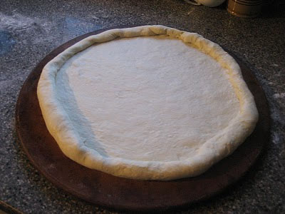

# Pizza dough

*A classic pizza dough, this dough is best when the finished base is made at least half an hour in advance to give it time to dry out. Prick the finished base with a fork a few times to allow the air to help cook the dough. Cheese can be added around the edge of the base, and wrapped into a stuffed crust.*

**Servings:** 6 people

## Ingredients
- 225 grams  white bread flour
- 1 teaspoon  sugar
- 7 grams  dried yeast
- 2 tablespoons  olive oil
- 85 ml milk
- 85 ml water
- half a teaspoon of salt

## Method
1. Place the flour, yeast and salt in a large bowl. 
1. Combine half the olive oil with the milk and water, and add to the dry ingredients. Stir with a wooden spoon to combine.
1. Place on a lightly floured work surface and knead for 5 minutes, or until soft and smooth. 
1. Lightly oil a bowl, add the dough and turn to coat in the oil. 
1. Leave in a warm place for 1 hour, or until doubled in size. Preheat the oven to 210°C.
1. Place the dough on a lightly floured surface and punch down to expel the air, and knead for about 5 minutes. 
1. Shape the dough into a neat ball and roll out to about 30 cm diameter. 
1. Lightly oil a pizza tray and place the dough on top.
