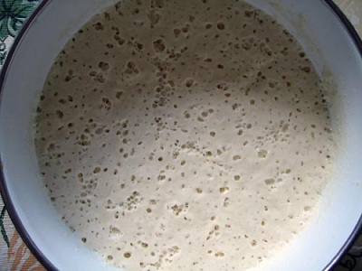

# Poolish

*Authentic French bread requires a pre-fermentation stage, known as a Poolish which consists of 100% water, 100% flour and about 1% yeast.
It is mixed together, and then allowed to ferment for about 18 hours before being added to the final dough mixture. From this point the process is
the same as making traditional bread, but he Poolish imparts a unique flavour, and helps improve the development of the bread.*

*The amount of water and flour needed for Poolish should be subtracted from the original dough recipe,
so if the recipe calls for 850 grams of flour and 510 grams of water (510 ml) and you use 200 grams of Poolish (100 grams water, 100 grams flour)
then when making the final dough, you will use 750 grams of flour, 410 grams of water and the Poolish (the final amount of water and dough will match
the recipe).*

## Ingredients
- 100 grams water
- 100 grams flour
- 1/4 teaspoon yeast

## Method
1. Add the yeast to the water, stirring continuously for 20 seconds.
1. Put the flour in a large mixing bowl, and add the yeast mixture.
1. Stir the mixture to help develop the long gluten strands, until a thick batter-like consistency is reached.
1. Cover the bowl with cling film, and leave to rest in a warm dry place, for 12 - 18 hours.
1. The Poolish is now ready to take the yeast and water mixture of the final dough, before adding in the final flour.