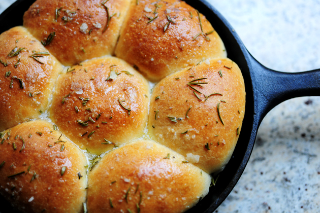

# Rosemary bread trio

*These fragrant bread buns compliment soups perfectly, and are equally delicious with a generous spread of creamy butter. Where most people go wrong is not making the mixture wet enough and so the finished bread ends up too doughy and dry. Once the water is added, don't flood the work surface with flour as it will unbalance the recipe, instead, use olive oil if need be.*

**Servings:** 10 people

## Ingredients
- 7 grams fast acting yeast
- 1 teaspoon caster sugar (for the yeast)
- 60 ml warm water (for the yeast)
- 500 grams plain flour
- 1 tablespoon caster sugar
- 1 1/2 teaspoons of salt
- 250 ml warm milk
- 60 ml vegetable oil
- 10 sprigs rosemary
- 1 egg yolk (mixed with 1 teaspoon of water)
- sea salt flakes (to decorate)

## Method
1. Combine the yeast, caster sugar and warm water in a bowl. 
1. Cover and set aside for 10 minutes until the yeast reacts with the water.
1. Sift the flour in a large bowl and stir in the remaining caster sugar and salt. 
1. Make a well in the centre and pour in the warm milk, oil and frothy yeast. 
1. Mix to a soft dough, gather into a ball then turn out onto a lightly floured surface and knead for 10 minutes, or until smooth and elastic.
1. Place the dough in a large oiled bowl, cover loosely with a damp tea towel and leave in a warm place for 1 hour.
1. Punch down the dough, then turn onto a very lightly floured surface and knead for 1 minute. 
1. Lightly grease 2 large baking trays. 
1. Divide the dough into 10 pieces, rolling each piece into a small ball. 
1. Arrange three balls together on the baking sheet and add a sprig of rosemary in the centre.
1. Cover the trios with a damp tea towel and set aside for 20 minutes, meanwhile preheat the oven to 180°C.
1. Lightly brush each trio with the egg mix and sprinkle with a few salt flakes and bake in the oven for 15 minutes, or until golden. 
1. Cool on a wire rack and replace the rosemary sprigs with fresh ones if necessary.