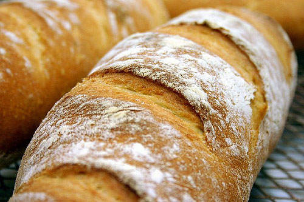

# White bread

*This bread forms a lovely crunchy crust when cooked, and is especially delightful when eaten warm. Where most people go wrong is not making the mixture wet enough and so the finished bread ends up too doughy and dry. Once the water is added, don't flood the work surface with flour as it will unbalance the recipe, instead, use olive oil if need be.*

## Ingredients
- 500 grams strong white flour
- 1 tablespoon of salt
- 14 grams fast acting yeast
- 50 ml olive oil
- 250 ml warm water

## Method
1. Sift the flour into a large bowl and add the salt, yeast, olive oil and water.
1. Mix the ingredients into a soft dough and knead well with your hands for about 10 minutes until the dough is smooth and elastic.
1. Cover with a clean tea towel and leave in a warm place for 1 hour to prove.
1. After the dough has rise and doubled in size, knock it back with your hands and tip it out on a very lightly flour work surface. 
1. Mould the dough into a rugby ball shape, then place on a baking sheet dusted with flour and leave to rise in a warm place for a further 30 minutes.
1. Meanwhile, preheat the oven to 230°C. 
1. When ready to bake, dust the top of the load with flour and score the top a few times using a sharp knife.
1. Bake in the oven for 30-35 minutes. To check whether the bread is cooked, turn it over and tape the base of the loaf - it should sound hollow. 
1. Place on a wire rack to cool.

