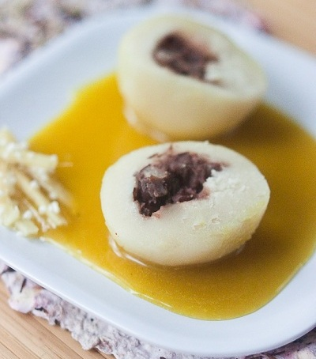

# Banana sauce

*With its Caribbean flavour, this simple sauce is a perfect accompaniment to a dish of exotic fruits*

**Servings:** 8

## Ingredients
- 2 medium bananas
- juice of 1 lemon
- 350 grams caster sugar
- 200 grams crème fraîche
- 100 ml white rum
- 150 ml milk

## Method
1. Peel the bananas, slice into rounds and immediately toss with the lemon juice to stop them discolouring.
1. Dissolve the sugar in 150 ml water in a heavy-based saucepan over a low heat, then bring to the boil and cook to a pale caramel. 
1. Take off the heat and add all the other ingredients, mixing gently with a spatula.
1. Return the pan to a medium heat and cook at a gentle bubble for about 20 minutes, delicately stirring the mixture frequently.
1. Leave the sauce to cool slightly, then transfer to a blender and purée for 1 minute. 
1. Pass the sauce through a fine-meshed conical sieve into a bowl and keep it in the fridge until ready to use.