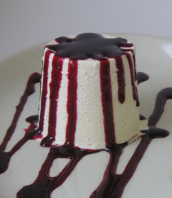

# Blackberry coulis

*Delicious served with poached pears, parfaits, ice bombes or ice creams.*

**Servings:** 

## Ingredients
- 450 grams blackberries
- 150 ml [sirop a sorbet](../../base-ingredients/syrup/sirop-a-sorbet.md)
- 50 ml Kirsch
- juice of half a lemon

## Method
1. Place all the ingredients into a blender and purée for about 1 minute until it forms a purée, then rub through a fine-meshed conical sieve.