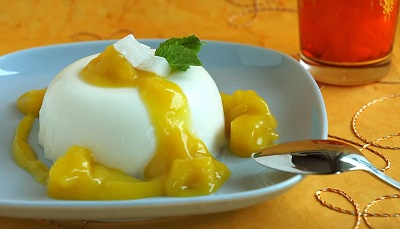

# Mango coulis with saffron

*This fragrant coulis can be served topped with soft poached meringues, as a variation of the classic floating islands, which uses a base of crème anglaise.*

**Servings:** 

## Ingredients
- 250 grams mango (diced)
- juice of 1/2 a lemon
- 250 ml [sirop a sorbet](../../base-ingredients/syrup/sirop-a-sorbet.md)
- pinch saffron threads

## Method
1. Put the diced mango into a blender with the lemon juice and all but 2 tablespoons of the sirop a sorbet. 
1. Purée the mixture for 2 minutes in a blender, then strain the purée through a fine-meshed conical sieve into a bowl.
1. In a small saucepan, warm the reserved syrup with the saffron threads, then leave to cool. 
1. When the syrup is cold, mix it into the mango coulis and chill until ready to serve. 