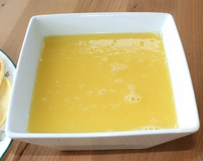

# Orange butter sauce

*A lovely rich, tangy sauce to serve with crêpes , a warm plum tart or a chocolate soufflé. A few drops of Grand Marnier can be added for extra warmth.*

**Serves:** 6

## Ingredients
- juice of 6 oranges
- 100 grams icing sugar
- 125 grams butter (softened)

## Method
1. Strain the orange juice through a conical sieve into a heavy-based saucepan and add the icing sugar. 
1. Slowly bring to the boil and let bubble over a medium heat until reduced by half.
1. Turn off the heat and whisk in the softened butter, a little at a time. 
1. Serve the sauce at room temperature.