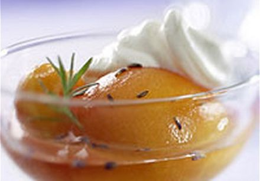

# Coulis of peaches with lavender honey

*This delectable sauce is superb served with slices of toasted brioche or with a panna cotta.*

**Servings:** 6

## Ingredients
- 4 very ripe peaches
- juice of 1 lemon
- 4 tablespoons lavender honey
- 1 flowering lavender sprig (optional)

## Method
1. Peel, halve and stone the peaches. 
1. Put them in a saucepan with the lemon juice, honey and 150 ml of water. 
1. Slowly bring to a simmer over a low heat and poach gently for 5 minutes. 
1. Add the lavender sprig, if using, and cook for a further 30 seconds.
1. Leave to cool for a few minutes, then transfer the contents of the pan to a blender and purée for 1 minute.
1. Pass the sauce through a fine-meshed conical sieve into a bowl and leave to cool completely. 
1. When cold, refrigerate until ready to use.