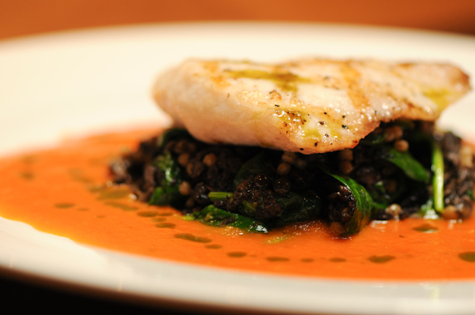

# Tomato Coulis

**Serves:** 4

## Ingredients
- 750 grams large marmande tomatoes (very ripe)
- 150 ml  olive oil
- 2 cloves garlic (crushed)
- 60 grams shallots (finely chopped)
- 6 sprigs thyme
- 1 tablespoon tomato purée (optional if the tomatoes are not fully ripe)
- 1 pinch sugar
- 6 peppercorns (crushed)
- 1 pinch salt
- 1 Bouquet garni (with extra thyme sprigs)

## Method
1. First peel the tomatoes: cut a cross on the top and cut out the core, then immerse the tomatoes in a bowl of boiling water for 10-20 seconds until the skin starts to split. 
1. Take out and plunge into a bowl of iced water.
1. Lift out with a draining spoon and slip off the skins.
1. In a heavy saucepan, warm the olive oil with the garlic, shallots and bouquet garni. 
1. After 2 minutes, add the tomatoes and the tomato purée if needed, along with the sugar and crushed pepper.
1. Cook very gently for 1 hour, stirring occasionally with a wooden spoon until all the moisture has evaporated. 
1. Remove the bouquet garni.
1. Tip the contents of the pan into a blender and purée until smooth. 
1. Season with salt to taste.
1. The coulis is ready to use at once, or it may be kept in the fridge for up to 5 days.
1. After reheating, add a little olive oil before serving.