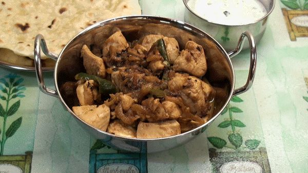

# Pre-Cooked Chicken

*Pre-cooked chicken recipe for use in BIR curries*

## Ingredients
- 3 Kg Chicken Breasts, cut into bite-sized chunks (approx. 8 per breast)
- 3 Large Onions, finely chopped
- 1 tbsp Cumin seeds
- 1 heaped tbsp Turmeric
- 6 Cloves
- 1" piece of Cinnamon Bark
- 1 tsp Garam Masala
- 2 tsp salt
- 2 tbsp Tomato Purée 
- 2 tbsp Fresh Coriander, chopped
- 1 mug water
- 500 ml Vegetable Oil (enough to cover the chicken)

## Method
### Step 1
- Add Onions, Salt, Cumin Seeds and Cinnamon to a large pot.
- Add enough water to the pan so that the Onions are covered.
- Cook for 1 hour on a low simmer.

### Step 2
- Cover the Onions with the oil and cook for a further 10 minutes.
- Add the remaining spices and cook for a further ½ an hour.

### Step 3
- Add the Chicken pieces and coat well with the mixture.
- Add more water if necessary.
- Cook for about 1 hour on a low heat until the Chicken is tender.
