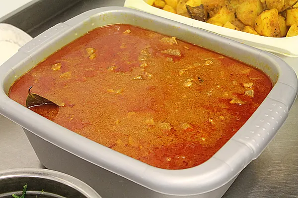

# Pre-Cooked Lamb

*Pre-cooked lamb recipe for use in BIR curries*

## Ingredients
- 3 lbs Lamb, diced with fat and skin cut off
- 2 onions, finely diced
- 1 tbsp Cumin seeds
- 2 tbsp Garlic/Ginger paste
- 2 tbsp Tomato Purée 
- 1 tsp Coriander Powder
- 1 tsp Chilli Powder
- 1 tbsp Turmeric
- 1 tbsp Methi
- 1 tsp Garam Masala
- 1 Curry leaf
- 1 tsp Sugar
- 1 tsp Salt
- Handful of fresh Coriander, chopped
- 300ml Vegetable Oil
- Water (enough to cover lamb)

## Method
1. Add oil to a large pot.
1. Add Onions, Cumin Seeds and the Garlic/Ginger paste and fry until the onions brown.
1. Add the Lamb and brown, sealing in the flavours for about 5 minutes.
1. Cover the Lamb with water.
1. Place lid on the pot and cook for 40 minutes over a medium heat.
1. Add the remaining ingredients.
1. Turn the heat down to low and simmer for about 40 minutes, stirring occasionally.
1. Place lid back on pot and cook for a further 20 minutes.
