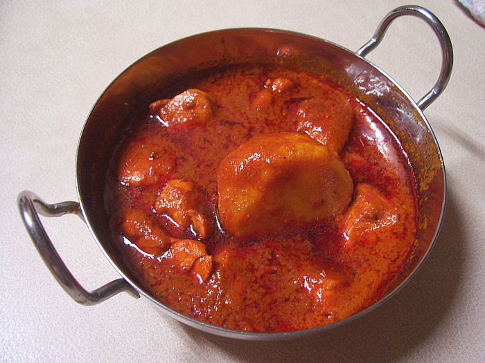

# BIR Chicken Masala Vindaloo

## Ingredients
- 8 pieces of [pre-cooked Chicken](../Base/pre-cooked-chicken.md)
- 4 tbsp Vegetable Oil
- ½ tsp Tomato Purée
- ½ heaped tsp Fenugreek Leaves
- 2 tbsp Garlic/Ginger paste
- 2 heaped tsp chilli powder
- 3 Fresh green Chillies - halved
- 1 tbsp Fresh Coriander
- 1 Tomato (quartered)
- 1 tbsp Red Masala Sauce
- ½ potato (pre-cooked)
- 250-300 ml [base sauce ](../Base/curry-base.md)

## Method
1. Add 2 tbsp of oil to a large pot.
1. Add Garlic/Ginger paste, tomato purée, fenugreek leaves, chilli powder, fresh chillies and half of the coriander.
1. Cook over a medium-high heat for about 30 seconds.
1. Add 4 tbsp base sauce.
1. Add the chicken and the rest of the oil.
1. Cook for a couple of minutes.
1. Add the potato.
1. Add more base sauce, fresh tomato, red sauce mix and cook for about 6 minutes until the oil separates from the base.
1. Remove excess oil and sprinkle with fresh coriander.