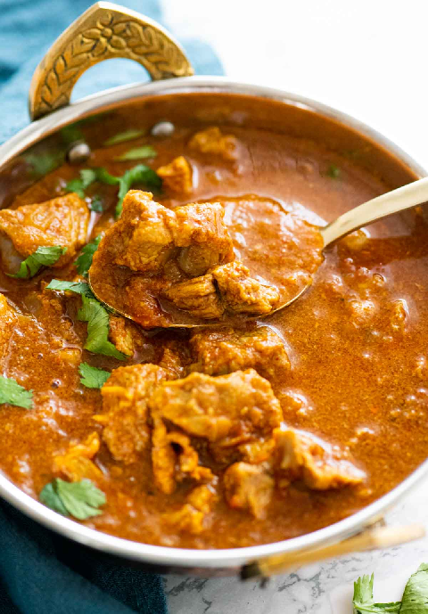

# Lamb Bhuna

**Serves:** 1 person   
**Cooking time:** 18 minutes

## Ingredients
- 3 tbsp Vegetable Oil
- 1 Small Onion (finely chopped)
- 5 Pieces [Pre-cooked Lamb](../Base/pre-cooked-lamb.md)
- Pinch Salt
- 2 tsp Fenugreek Leaves (Methi)
- 1 tsp Cumin Seeds
- 1 tsp Turmeric Powder
- 2 tbsp Garlic/Ginger Paste
- 2 Fresh green Chillies (finely chopped)
- 2 tbsp tomato purée 
- 1 Tomato (diced)
- 3 tbsp [Base Sauce](../Base/curry-base.md)
- Fresh Coriander

## Method
### Step 1
- Add onions and oil to a pan and cook over a medium-high heat.
- Add 1 tsp of Fenugreek leaves.
- Add salt and Cumin Seeds.
- Cook until Onions are soft (Stirring occasionally).

### Step 2
- Add a pinch of Turmeric.
- Add 1 tsp Garlic/Ginger paste and tomato purée.
- Add chopped chillies, tomatoes and 1 tsp Fenugreek leaves.
- Cook for about a minute (Stirring occasionally).

### Step 3
- Add Lamb.
- Cook for a further minute.
- Add chopped Coriander.
- Cook for a further minute.
- Add base sauce.
- Turn heat down to low, cover and steam for about 10 minutes.