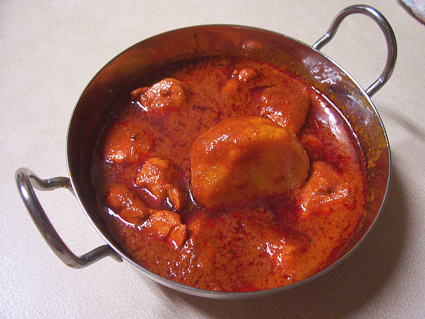

# Vindaloo 

   
*Many restaurants include potato in their vindaloo curries. ‘Aloo’ means potato in Hindi, so a lot of the original self-taught Bangladeshi and Pakistani chefs in the UK mistakenly added potatoes to this fiery curry, and it stuck. Vindaloo, however, owes its origins to Portuguese- controlled Goa in the 15th century, where the dish was usually served with pork.*

**Note**: The recipe here calls for Indian Bay leaf, which has a subtle cinnamon and clove taste, and less woody than the European counterpart.

**Prep Time:** 10 Minutes   
**Cooking Time:** 10 Minutes   
**Serves:** 4 People

## Ingredients
### Step 1
- 3 tbsp oil
- 6 green cardamom pods (crushed)
- 1 Indian Bay leaf
### Step 2
- 2 tbsp Garlic and Ginger paste
- 2 fresh green Bullet Chillies (finely chopped)
- 2 Scotch Bonnet chillies (finely chopped)
- 1 tsp Ground Turmeric
- 2 Tbsp hot Chilli powder
- 2 Tbsp [Mixed Powder](../Base/mixed-powder.md)
- 125ml (½ Cup) Tomato puree
- 2 tsp sugar
### Step 3
- 600ml (2½ Cups) [base sauce](../Base/curry-base.md)
- 8 pieces of [pre-cooked Chicken](../Base/pre-cooked-chicken.md) or [pre-cooked Lamb](../Base/pre-cooked-lamb.md)
### Step 4
- 2 Tbsp white wine vinegar
- 1 tsp Dried Fenugreek leaves
- 2 pre-cooked stewed potatoes (quatered)
- 3 Tbsp Chopped Coriander
- Salt and freshly ground black papper

## Method
### Step 1
1. Heat the oil over a medium-high heat.
2. When the oil begins to bubble, add the Cardamom and Bay Leaf.
### Step 2
1. Add the Garlic and Ginger paste and fry for 1 minute.
2. Add the chopped Chillies, Turmeric, Chilli powder and Mixed Powder.
3. Add the Tomato Puree and Sugar.
4. Mix and allow the Tomato Puree to bubble.
### Step 3
1. Pour in 250ml (1 cup) of the Base Sauce and allow it come to a rolling simmer.
2. Don't stir the saue unless it looks like it is going to catch.
3. Scrape back any sauce that caremelises around the sides of the pan.
4. The sauce should be going crazy over the heat.
5. Swirl in the remaining base sauce.
6. Add the meat to the sauce.
7. Let the sauce summer over a high heat, until it cooks down to your desired consistency
### Step 4
1. Add the vinegar, dried fenugreek and potatoes.
2. Add the coriader and season with salt and black pepper.
