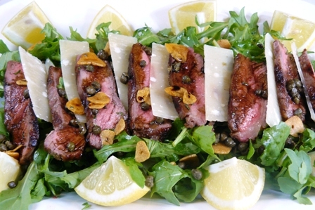

# Beef tagliata

*The name comes from tagliare, the Italian for 'to cut'; tagliata is a dish of seared steak cut into slices and served with rocket and Parmesan shavings.*

*Searing is a great skill to master, the key is to have the pan really hot before starting. Rubbing the steak with oil is better than putting oil directly in the pan, and salting the streak afterwards instead of during cooking helps bring out the juices during resting instead of cooking.*

**Serves:** 4

## Ingredients
- olive oil (for cooking)
- 120 ml olive oil
- 2 sirloin steaks (approx. 400 grams each)
- salt and freshly ground black pepper
- 3 garlic cloves (peeled and crushed)
- 4 sprigs of rosemary
- 1 lemon (zested and juiced)
- 60 grams rocket leaves
- 40 grams Parmesan shavings

## Method
1. Place a heavy-bottomed frying pan over a hight heat, and add a teaspoon of olive oil and heat until the pan begins to smoke.
1. Meanwhile, rub the streaks with olive oil to coat them, and place in the hot pan for 15 - 20 seconds.
1. Turn the steaks over and fry for a further 15 - 20 seconds.
1. Repeat this, turning the steaks over, for 2 - 3 minutes depending on how well the steaks need to be cooked (see notes).
1. Remove the steak from the pan, and rest on a wire rack with a plate underneath to catch the juices.
1. Remove the pan from the heat, and discard most of the oil.
1. Allow the pan to cool for a few minutes, then pour in the olive oil.
1. Add the garlic and the rosemary to the oil.
1. Rub the lemon zest between your fingers to release the oils, and add to the pan.
1. Allow to infuse for 5 minutes while the meat is resting, then add 50 ml of lemon juice.
1. Mix the dressing well and add the resting juices from the steak. Strain the dressing through a fine-meshed conical sieve.
1. Slice the streaks thinly (5 mm wide) with a sharp knife.
1. Season with salt and freshly ground pepper and place on a serving dish. Spoon over half the dressing.
1. Mix the rocket leaves with the remaining dressing and place on top of the steak.
1. Finish with the Parmesan shavings and a sprinkling of sea salt crystals.

The level of done-ness of a steak can be determined by measuring the internal temperature of the meat.

*bleu 45°C, rare 50°C, medium-rare 55°C, medium 60°C and well done 70°C*